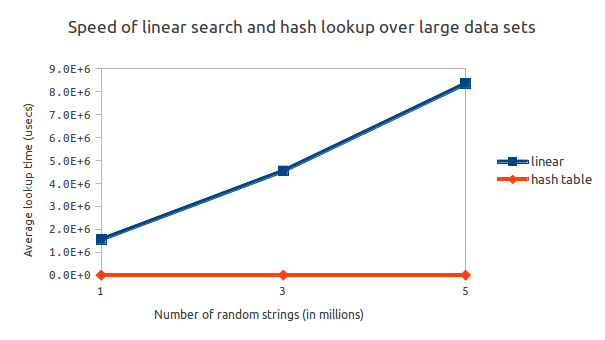

##Performance of Hash Lookup vs. Linear Search
AbstractOwl

----

In this experiment, I observed the speed of hash lookup and linear search of 100 items over a set of 1M, 3M, and 5M random strings. As shown in the graph on the next page, hash lookup clearly holds the advantage, especially over increasingly large data sets. Where the linear search had to start at index 0 each time, the hash lookup only had to traverse several items with the same hash to find its target. The difference in search time between the set of 1M and 5M random strings in the hash table increased an average of only 63 microseconds, not even doubling the time of the 1M search. The linear search on the other hand, jumped an average of 6798106 microseconds, taking over 5x as long as the 1M search.\

Furthermore, I discovered that the *number of available hashes* had a large impact on hash table performance. While mod-ing the hash function by 100 worked fine for five or ten items, when I applied the same function to a set of one million items, inserting all the items alone took five to six seconds. However, once I boosted the number of hashes available, the insertion and lookup became nearly instantaneous again.\

This time-memory trade-off occurs due to the fact that linear search is used after the hash lookup. Increasing the table size decreases the number of collisions, expediting the search.\

